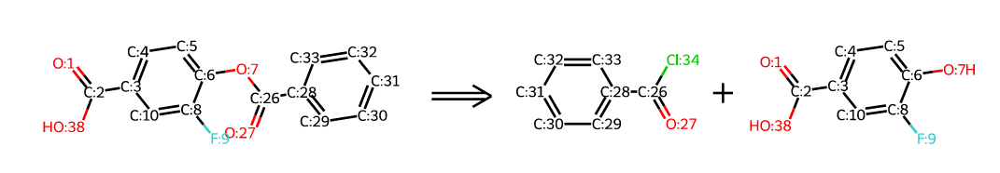

Computer-assisted Retrosynthesis Workshop Schedule
**********************************************************

| **Vincent F. Scalfani**
| *Chemistry and Informatics Librarian*
| vfscalfani@ua.edu
| `lib.ua.edu`_

.. _lib.ua.edu: https://www.lib.ua.edu/#/home

Overview
============

UA Libraries will be hosting a workshop series on open source computer-assisted retrosynthesis workflows. These workshops will use python programming
and cheminformatics techniques for predicting retrosynthesis. Why attend?

- Enhance your chemical synthesis literature searching skills
- Learn how to use the cheminformatics toolkit, RDKit, for working with digital molecules and reactions
- Work through several open source retrosynthesis workflows, including software and methods published by scientists at **MIT, AstraZeneca, and Eli Lilly**

.. note::

   **Registration Links:** Registration is required -- morning sessions: `ua.libcal.com/calendar/instruction/morning_retro`_; afternoon sessions: `ua.libcal.com/calendar/instruction/afternoon_retro`_

   **Location**: Rodgers Library Scholars' Station.

   **Time and Duration**: All workshops will be offered twice on the date scheduled in order to accommodate schedules (see below). The morning session will start at **10:00 AM** and the afternoon session will start at **3:30 PM**; expected durations are about 1 hour.

   **Technology**: Computers will be available for use, but we recommend bringing your own laptop so we can help you set up your development environment. The code is designed for Linux and Mac. If you are using Windows, we suggest installing Windows Subsystem for Linux. A GitHub account is also recommended.

   **Additional Information:** Prior programming experience is beneficial but not necessary. You will still learn how to get started, even if you don't fully understand all the code during the workshops.

   **Reusue and sharing:** Code presented during the workshops is available here: `github.com/ualibweb/retrosynthesis`_

   .. _github.com/ualibweb/retrosynthesis: https://github.com/ualibweb/retrosynthesis
   .. _ua.libcal.com/calendar/instruction/morning_retro: https://ua.libcal.com/calendar/instruction/morning_retro
   .. _ua.libcal.com/calendar/instruction/afternoon_retro: https://ua.libcal.com/calendar/instruction/afternoon_retro

.. list-table::
   :widths: 10 10 20 35 25
   :header-rows: 1

   * - Day
     - Date
     - Workshop Title
     - Notes
     - Reference
   * - Day 1
     - Tues, Sept. 17
     - Overview and Python Introduction
     - Intro to methods covered and retrosynthesis; environment setup; basic python programming.
     - 
   * - Day 2
     - Wed, Sept. 18
     - Part 1 RDKit Cheminformatics
     - SMILES file format;
       reading and working with molecules;
       molecule depiction;
       canonicalization, identifiers, and hashes;
       chemical similarity and fingerprints;
       substructure search.
     - `rdkit.org`_
   * - Day 3
     - Thurs, Sept. 19
     - Part 2 RDKit Cheminformatics
     - Descriptors;
       reading and working with reactions;
       reaction depiction;
       reaction transformations;
       molecule and reaction standardization.
     - `rdkit.org`_
   * - Day 4
     - Tues, Sept. 24
     - AiZynthFinder Retrosynthesis
     - Template based neural network model.
     - `10.1186/s13321-020-00472-1`_
   * - Day 5
     - Wed, Sept. 25
     - Retrosynthesis based on Similarity Ranking
     - Deterministic prediction model from start to finish.
     - `10.1021/acscentsci.7b00355`_
   * - Day 6
     - Thurs, Sept. 26
     - LillyMol Retrosynthesis
     - C++ command line based deterministic model.
     - `10.1186/s13321-018-0323-6`_
     
.. _rdkit.org: https://www.rdkit.org/
.. _10.1186/s13321-020-00472-1: https://doi.org/10.1186/s13321-020-00472-1
.. _10.1021/acscentsci.7b00355: https://doi.org/10.1021/acscentsci.7b00355
.. _10.1186/s13321-018-0323-6: https://doi.org/10.1186/s13321-018-0323-6

Have questions? Interested but can't attend? Contact: vfscalfani@ua.edu
